# Abstract & DOI Finder

A simple tool to retrieve <abbr title="Digital Object Identifier">DOI</abbr>s and abstracts of research articles inserted as spreadsheet.

## How-to Use

- First, we need some set-up:
    - [Prepare a spreadsheet](#sheet-requirements),
    - If you don't have an account on [github](https://github.com/), [create one](https://github.com/signup) and make sure you are logged-in.

- We will now create a copy of the program:
    - Go to <https://github.com/popbr/abstract_doi_finder/fork>, to "fork" (that is, create a copy of) our repository (that is, the program code),
    - Leave everything by default, and click on "Create fork":  
      > 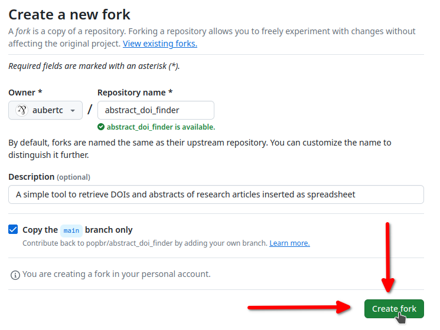  
    - You should now see your own fork: you can make sure by checking that the address bar is of the form `https://github.com/<your-username>/abstract_doi_finder`, where `<your-username>` is your username (`aubertc` in the example below). 

- We will now upload our own spreadsheet.
    Click on the "abstract_doi_finder" folder:  
    > 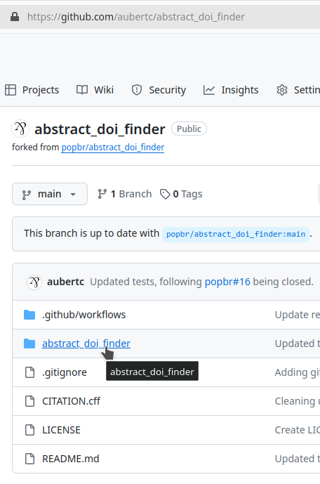
    
    then click on the "input" folder, and click on the "Upload files" button hidden under the "Add file" button:  
    > 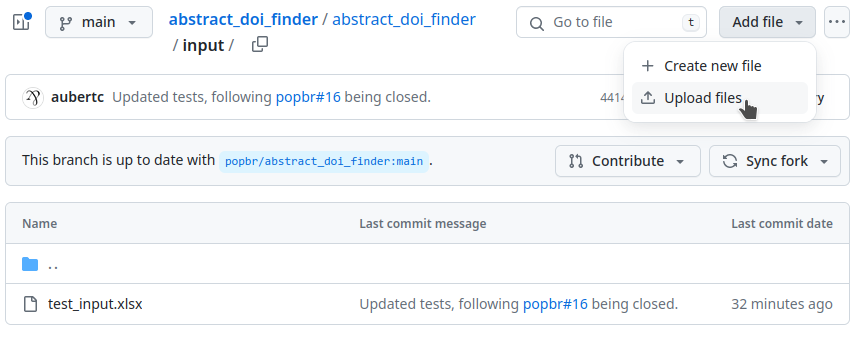

    Upload your spreadsheet, and click on "Commit changes":  
    > 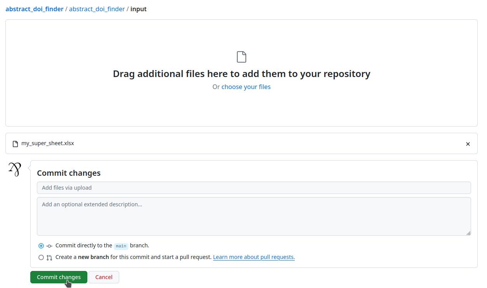

    
- Now we will delete the spreadsheet loaded by default.

    Go back in the "input" folder, and click on the "test_input.xlsx" file. On the right of the screen, click on the three dots, then on "Delete file":  
    > 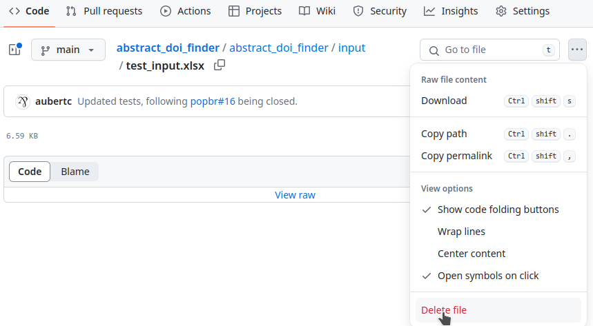
    
    Finally, click on "Commit changes…" twice:  
    > 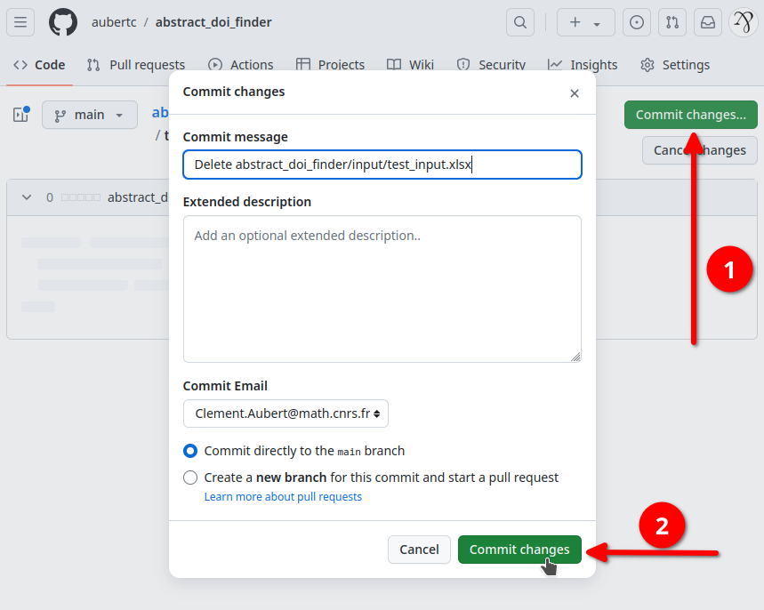

- Now, we will execute the program on our spreadsheet and download the resulting spreadsheet.

    Click on "action", and then on "I understand my workflows, go ahead and enable them":  
    > 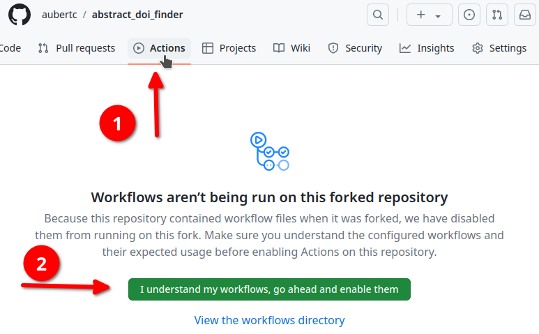
    
    Then, click on "Remote Execution", then on "Run workflow" (twice):  
    > 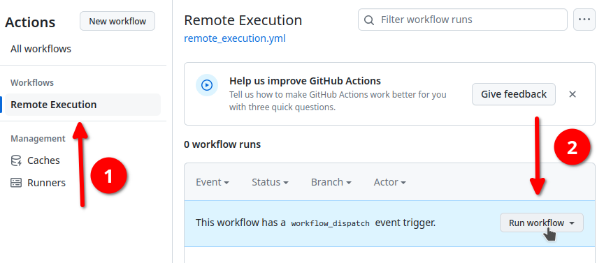
    
    Be patient, your workflow will be executed:  
    > 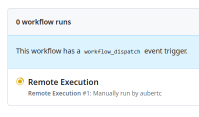
    
    Once it is over, a green check will replace the orange wheel. Click on it:  
    > 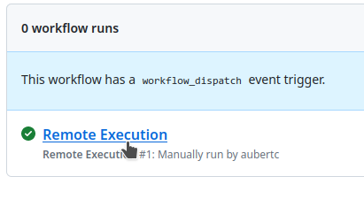

    Then, scroll down and click on "Remote_execution" under "Artifacts":  
    > 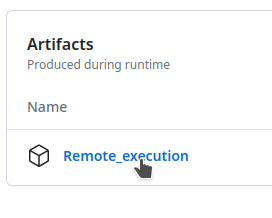
    
    That's it, your download of the resulting spreadsheet should begin!

## Sheet Requirements

_To be written_

## How-to Compile and Execute

### Pre-requisites

- [Maven](https://maven.apache.org/install.html) (tested with Maven 3.9.6),
- Java (tested with Java 17.0.9),
- A [spreadsheet](#sheet-requirements).

### Compiling and Running the Program

```
cd abstract_doi_finder/
mvn compile
mvn exec:java -Dexec.mainClass="popbr.AbstractDoiFinder" -Dexec.args="input_file.xlsx 1,3"
```

where 

- `input_file.xlsx` is the name of the spreadsheet placed in the `abstract_doi_finder/input/` folder (this argument is optional if only one sheet is in the `input/` folder, mandatory otherwise), and
- `1,3` are the sheets you want to run the program on. Please separate the values with commas, exclude spaces, or follow the examples below.

The range can be provided (or omitted) in a multitude of ways including:

- "*" can be used to run the program on all sheets. This is also the default if no sheet range is provided.
- "1,3" would run the program on sheets 1 and 3,
- "4-10" would run the program on sheets 4, 5, 6, 7, 8, 9, and 10,
- "10-*" would run the program from sheet 10 to the last sheet.
